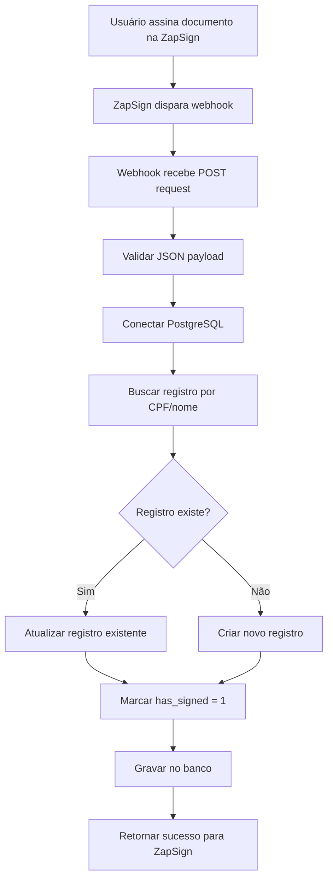

# Webhook ZapSign - Documentação Completa

Este webhook recebe notificações da ZapSign quando documentos são assinados e atualiza automaticamente a tabela `sind.associados_sasmais` no PostgreSQL.

## 📋 Arquivos Necessários

1. **`webhook_zapsign.php`** - Script principal do webhook
2. **`webhook_zapsign_config.php`** - Arquivo de configuração
3. **`README_webhook_zapsign.md`** - Esta documentação
4. **`teste_conexao_banco.php`** - Script de teste de conexão (deletar após usar)

## 🚀 Instalação

### Passo 1: Configurar o Banco de Dados

Certifique-se de que sua tabela PostgreSQL tem a estrutura correta:

```sql
-- Verificar/criar colunas necessárias na tabela existente
ALTER TABLE sind.associados_sasmais 
ADD COLUMN IF NOT EXISTS event VARCHAR(50),
ADD COLUMN IF NOT EXISTS doc_token VARCHAR(255),
ADD COLUMN IF NOT EXISTS doc_name VARCHAR(500),
ADD COLUMN IF NOT EXISTS signed_at TIMESTAMP,
ADD COLUMN IF NOT EXISTS name VARCHAR(255),
ADD COLUMN IF NOT EXISTS email VARCHAR(255),
ADD COLUMN IF NOT EXISTS cpf VARCHAR(11),
ADD COLUMN IF NOT EXISTS has_signed INTEGER DEFAULT 0,
ADD COLUMN IF NOT EXISTS cel_informado VARCHAR(20);

-- Criar índices para melhor performance
CREATE INDEX IF NOT EXISTS idx_associados_sasmais_cpf ON sind.associados_sasmais(cpf);
CREATE INDEX IF NOT EXISTS idx_associados_sasmais_doc_token ON sind.associados_sasmais(doc_token);
```

### Passo 2: Configurar o Arquivo de Configuração

Edite o arquivo `webhook_zapsign_config.php`:

```php
// ATENÇÃO: Este webhook usa o arquivo de conexão existente do sistema
// Arquivo: Adm/php/banco.php
// Classe: Banco::conectar_postgres()
// 
// Não é necessário configurar credenciais de banco aqui!

// Habilitar logs para desenvolvimento
define('ENABLE_DEBUG_LOGS', true);

// Para produção
define('ENABLE_DEBUG_LOGS', false);
```

**IMPORTANTE**: Este webhook usa o arquivo de conexão existente `Adm/php/banco.php` do seu sistema. Não é necessário configurar credenciais de banco separadamente.

### Passo 3: Upload dos Arquivos

Faça upload dos arquivos para seu servidor web:

```
/var/www/html/
├── webhook_zapsign.php
├── webhook_zapsign_config.php
└── README_webhook_zapsign.md
```

### Passo 4: Configurar Permissões

```bash
# Definir permissões corretas
chmod 644 webhook_zapsign.php
chmod 600 webhook_zapsign_config.php  # Mais restritivo por conter senhas
chmod 666 webhook_zapsign.log         # Permitir escrita do log
```

## 🔧 Configuração na ZapSign

### 1. Acessar o Dashboard ZapSign

- Acesse: https://app.zapsign.com.br/dashboard/api
- Vá para a seção "Webhooks"

### 2. Criar Novo Webhook

- **URL do Webhook**: `https://seudominio.com/webhook_zapsign.php`
- **Eventos a Monitorar**: 
  - ✅ `doc_signed` (documento assinado)
  - ✅ `doc_completed` (documento completado) - opcional
- **Método HTTP**: POST
- **Content-Type**: application/json

### 3. Configurar Autenticação (Opcional)

Se desejar maior segurança, configure um token secreto:

```php
// No arquivo webhook_zapsign_config.php
define('WEBHOOK_SECRET_TOKEN', 'seu_token_secreto_aqui');
```

E configure o mesmo token na ZapSign.

## 🧪 Testes

### Teste 0: Verificar Conexão com Banco (PRIMEIRO TESTE)

**IMPORTANTE**: Execute este teste ANTES de configurar o webhook!

Acesse no navegador:
```
https://seudominio.com/teste_conexao_banco.php
```

Este teste verifica:
- ✅ Se o arquivo `Adm/php/banco.php` existe
- ✅ Se a classe `Banco` está funcionando
- ✅ Se a conexão PostgreSQL está OK
- ✅ Se a tabela `sind.associados_sasmais` existe
- ✅ Se as colunas do webhook estão criadas

**⚠️ ATENÇÃO**: DELETE este arquivo após o teste por segurança!

### Teste 1: Verificar Status do Webhook

Acesse no navegador:
```
https://seudominio.com/webhook_zapsign.php?status=1
```

Resposta esperada:
```json
{
    "webhook": "ZapSign Webhook",
    "version": "1.0",
    "timestamp": "2024-12-19 14:30:00",
    "config": {
        "connection_file": "Adm/php/banco.php",
        "connection_class": "Banco::conectar_postgres()",
        "table": "sind.associados_sasmais",
        "debug_logs": "enabled"
    },
    "database_status": "connected",
    "connection_method": "Sistema existente (Adm/php/banco.php)"
}
```

### Teste 2: Simular Webhook Manual

Use este comando curl para testar:

```bash
curl -X POST https://seudominio.com/webhook_zapsign.php \
  -H "Content-Type: application/json" \
  -d '{
    "event": "doc_signed",
    "doc_token": "13a2a55a-teste-xxxx-xxxx-82dd3d2abdc9",
    "doc_name": "Contrato de teste.pdf",
    "signed_at": "2024-12-19T16:59:20.627892-03:00",
    "signers": [
      {
        "name": "João Teste",
        "email": "joao@teste.com",
        "cpf": "12345678901",
        "has_signed": true,
        "signed_at": "2024-12-19T16:59:18-03:00"
      }
    ]
  }'
```

### Teste 3: Verificar Logs

```bash
# Ver os logs em tempo real
tail -f webhook_zapsign.log

# Ver as últimas 50 linhas
tail -n 50 webhook_zapsign.log
```

## 📊 Monitoramento

### Verificar Funcionamento

1. **Logs do Webhook**: `webhook_zapsign.log`
2. **Logs do Servidor Web**: `/var/log/nginx/error.log` ou `/var/log/apache2/error.log`
3. **Logs do PostgreSQL**: `/var/log/postgresql/postgresql-*.log`

### Consultas SQL Úteis

```sql
-- Ver registros com dados de assinatura
SELECT codigo, nome, has_signed, signed_at, doc_token 
FROM sind.associados_sasmais 
WHERE event = 'doc_signed'
ORDER BY signed_at DESC;

-- Contar assinaturas por dia
SELECT DATE(signed_at) as data, COUNT(*) as assinaturas
FROM sind.associados_sasmais 
WHERE event = 'doc_signed'
GROUP BY DATE(signed_at)
ORDER BY data DESC;

-- Ver últimas assinaturas
SELECT nome, email, cpf, signed_at, doc_name
FROM sind.associados_sasmais 
WHERE has_signed = 1
ORDER BY signed_at DESC 
LIMIT 10;
```

## 🔒 Segurança

### Recomendações de Produção

1. **Desabilitar logs detalhados**:
```php
define('ENABLE_DEBUG_LOGS', false);
```

2. **Configurar HTTPS obrigatório**:
```php
if (!isset($_SERVER['HTTPS']) || $_SERVER['HTTPS'] !== 'on') {
    http_response_code(403);
    exit('HTTPS obrigatório');
}
```

3. **Validar IPs da ZapSign**:
```php
define('ALLOWED_IPS', ['IP_DA_ZAPSIGN_1', 'IP_DA_ZAPSIGN_2']);
```

4. **Backup automático dos logs**:
```php
define('MAX_LOG_SIZE', 5 * 1024 * 1024); // 5MB
```

## 🐛 Troubleshooting

### Problemas Comuns

#### 1. Webhook não recebe dados
- **Verificar**: URL do webhook na ZapSign
- **Verificar**: Permissões do arquivo PHP
- **Verificar**: Logs do servidor web

#### 2. Erro de conexão com banco
- **Verificar**: Se o arquivo `Adm/php/banco.php` existe
- **Verificar**: Se a classe `Banco` está correta no arquivo
- **Verificar**: Se o PostgreSQL está rodando
- **Verificar**: Permissões de acesso ao arquivo banco.php

#### 3. Dados não são gravados
- **Verificar**: Estrutura da tabela (colunas existem?)
- **Verificar**: Permissões do usuário do banco
- **Verificar**: Logs do webhook para erros SQL

#### 4. CPF não encontrado
- **Solução**: O webhook vai criar um novo registro
- **Nota**: O código será preenchido quando a adesão for processada

### Logs de Debug

Para debugar problemas, habilite logs detalhados:

```php
define('ENABLE_DEBUG_LOGS', true);
```

Os logs incluem:
- Headers HTTP recebidos
- JSON payload completo
- Queries SQL executadas
- Resultados das operações
- Erros detalhados

## 📞 Suporte

Se você encontrar problemas:

1. **Verificar logs primeiro**: `webhook_zapsign.log`
2. **Testar conexão**: Acessar `webhook_zapsign.php?status=1`
3. **Verificar estrutura do banco**: Executar queries de verificação
4. **Testar manualmente**: Usar comando curl de teste

## 🔄 Fluxo Completo



Este webhook garante que todas as assinaturas digitais sejam automaticamente registradas no seu sistema, permitindo verificação em tempo real do status de cada adesão ao Sascred. 